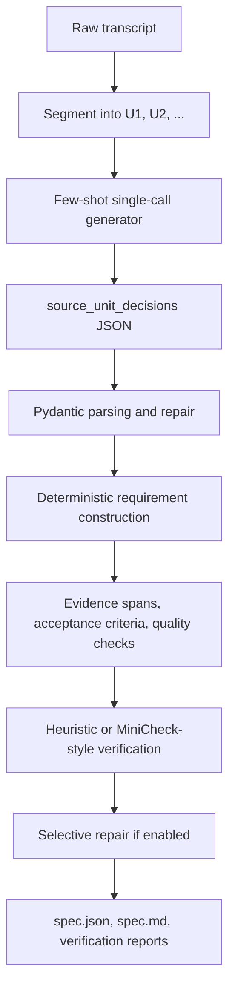

# Conversation-to-Spec

`conversation-to-spec` converts informal client-developer conversations into
traceable software requirement drafts. It is a Python NLP course project, not a
web app.

The current `v0.1.1` direction is a verifier-guided few-shot pipeline:

```text
Conversation
-> source-unit preprocessing
-> few-shot single-shot source-unit decision generation
-> deterministic spec construction
-> quality checks
-> claim-evidence verification
-> selective repair when enabled
-> spec.json / spec.md / verification reports
```

This is a lightweight traceability layer. It does not implement full RAG,
Graph-RAG, or a full reproduction of RAGAS/MiniCheck.

## Current Pipeline



The production pipeline is single-shot only. The earlier multi-stage chain mode
and production `--mock` path were removed because they did not represent the
real model behavior being evaluated. Tests use lightweight fake runners instead.

## What The LLM Generates

The LLM does not generate the full final schema. The current prompt asks for:

- a short `project_summary`
- flat `source_unit_decisions`
- one or more decision rows per relevant conversation unit
- optional short source-backed `claim` text for an atomic decision

The prompt explicitly tells the model not to generate final requirements,
evidence spans, acceptance criteria, quality checks, or verification fields.
Those fields are filled by deterministic post-processing and the verifier.

This design was chosen because small local models are more reliable when they
classify and extract short source-grounded decisions than when they must produce
a large nested specification schema in one pass.

## What It Produces

Each run writes:

- `spec.json`: validated structured specification
- `spec.md`: readable Markdown specification
- `verification_report.json`: requirement-level verification results
- `verification_report.md`: readable verification report
- `debug/spec/`: raw model output, repaired JSON, warnings, and summary

Each generated requirement or constraint includes:

- `source_units`: referenced conversation unit IDs
- `evidence_spans`: source-grounded evidence text
- `acceptance_criteria`: Given/When/Then-style criteria when possible
- `quality_checks`: atomicity, testability, actor clarity, traceability, ambiguity
- `verification`: source relevance, verdict, confidence, and warnings

## Default Model

The default model is configured in [configs/models.yaml](configs/models.yaml):

```yaml
default_model: qwen3_0.6b

models:
  qwen3_0.6b:
    hf_repo_id: Qwen/Qwen3-0.6B
```

The default generation settings use deterministic decoding and a larger token
budget to reduce truncated JSON:

```yaml
generation:
  max_new_tokens: 2048
  temperature: 0.0
  do_sample: false
```

Qwen reasoning output is handled defensively. The prompt requests JSON only and
`/no_think`, and the parser strips `<think>...</think>` blocks before JSON
parsing.

## Quick Start

Install dependencies:

```bash
uv sync
```

Run a sample with the default model:

```bash
uv run python -m app.main \
  --input samples/sample_cafe_website.txt \
  --output output
```

Run with explicit options:

```bash
uv run python -m app.main \
  --input samples/sample_cafe_website.txt \
  --output output \
  --model qwen3_0.6b \
  --prompt-style few_shot \
  --verify-mode heuristic \
  --repair-on-fail
```

Use a direct Hugging Face repository ID:

```bash
uv run python -m app.main \
  --input samples/sample_cafe_website.txt \
  --output output \
  --model Qwen/Qwen3-0.6B
```

Single-run outputs are written to timestamped directories:

```text
output/YYYYMMDD_HHMMSS__<model>__single_shot/
```

## Verification Modes

The CLI supports:

| Mode | Meaning |
| --- | --- |
| `off` | Skip requirement verification. |
| `heuristic` | Use deterministic claim-evidence checks. |
| `llm` | Use heuristic checks plus selective LLM verification for weak cases. |
| `minicheck` | Use the MiniCheck-style classifier backend when available. |

`minicheck` is the CLI default, but course-report experiments may explicitly use
`--verify-mode heuristic` for reproducibility and lower runtime. When reporting
results, check each run's `run_config.json` before claiming which verifier was
used.

The verifier can label requirements as:

- `SUPPORTED`
- `PARTIALLY_SUPPORTED`
- `UNSUPPORTED`
- `CONTRADICTED`
- `NOT_ENOUGH_INFO`
- `NOT_CHECKED`

The deterministic verifier checks:

- referenced source units exist
- evidence spans are present for traceable claims
- acceptance criteria are non-empty
- vague words such as `fast`, `easy`, `simple`, `secure`, and `reliable` are not
  marked testable without measurable context
- numeric thresholds are not introduced unless grounded in source evidence
- future-scope or excluded items are not promoted into first-release requirements

## Evaluation

Evaluate one model:

```bash
uv run python -m app.main \
  --evaluate \
  --dataset dataset/eval_samples.json \
  --model qwen3_0.6b \
  --verify-mode heuristic \
  --repair-on-fail
```

Compare configured models:

```bash
uv run python -m app.main \
  --evaluate \
  --dataset dataset/eval_samples.json \
  --all-models
```

`--all-models` reads `compare_models` from `configs/models.yaml`. Make sure each
entry in `compare_models` has a matching alias under `models` before running a
large comparison.

Evaluation outputs are written under:

```text
eval_output/YYYYMMDD_HHMMSS/<model>__single_shot/
```

## Metrics

The evaluator reports both extraction and verification metrics:

| Metric | Meaning |
| --- | --- |
| Functional / non-functional / constraint F1 | Exact-match requirement extraction score. |
| Semantic functional / non-functional / constraint F1 | Lightweight token-overlap semantic match. |
| Semantic requirement macro-F1 | Macro average of semantic FR/NFR/constraint F1. |
| Hallucination rate | Predicted requirements not matched to gold items. |
| Acceptance criteria coverage | Fraction of requirements with criteria. |
| Evidence span coverage | Fraction with evidence spans. |
| Traceability coverage | Fraction with valid source units and evidence. |
| Quality gate pass rate | Fraction passing atomic/testable/actor/evidence checks. |
| High ambiguity rate | Fraction marked high ambiguity. |
| Source relevance average | Average source-claim relevance score. |
| Groundedness rate | Fraction marked `SUPPORTED` or `PARTIALLY_SUPPORTED`. |
| Unsupported requirement rate | Fraction marked unsupported, contradicted, or not enough info. |
| Verification pass rate | Fraction marked `SUPPORTED`. |
| Schema validity rate | JSON parse and Pydantic validation success. |
| Latency / LLM calls | Average runtime and model-call count. |

## Project Structure

```text
conversation-to-spec/
├── app/
│   ├── main.py              # CLI entry point
│   ├── segmenter.py         # transcript segmentation
│   ├── schemas.py           # Pydantic schemas
│   ├── prompt_builder.py    # few-shot single-shot prompt
│   ├── model_runner.py      # local Hugging Face runner
│   ├── extractor.py         # JSON parsing, repair, spec construction
│   ├── quality.py           # acceptance criteria and quality checks
│   ├── verifier.py          # heuristic/MiniCheck-style verification and repair
│   ├── pipeline.py          # orchestration
│   ├── formatter.py         # Markdown formatting
│   ├── evaluation.py        # metrics and comparison tables
│   └── progress.py          # CLI progress logging
├── configs/
├── dataset/
├── samples/
├── output/
├── eval_output/
└── tests/
```

## Testing

```bash
uv run pytest
```

If `uv` cannot access its cache directory on Windows, fix the local cache
permissions and rerun the command before reporting a fresh test count.

## Limitations

- Small local models can still misclassify source units or copy few-shot example
  wording if the prompt is too domain-specific.
- The current semantic evaluator is deterministic and lightweight; it is not a
  learned semantic similarity model.
- The verifier improves traceability but does not replace human requirements
  review.
- Full RAGAS, Graph-RAG, and full MiniCheck reproduction are out of scope.
- The available evaluation datasets are small, so reported results should be
  treated as course-project evidence rather than broad generalization.
