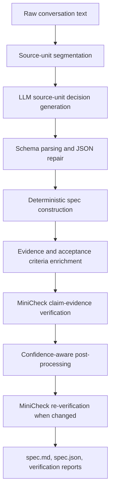

# Conversation-to-Spec

`conversation-to-spec` turns an informal, unlabeled conversation into a
traceable software requirements draft. It is designed as a local NLP course
project pipeline: an LLM extracts source-grounded decisions, deterministic
post-processing builds the specification, and MiniCheck verifies whether each
requirement is supported by the original conversation.

The main output for users is `spec.md`. Detailed verification data is kept in
JSON files so the Markdown specification remains readable.

## What It Does

Given a plain text conversation, the system produces:

- a project summary
- functional requirements
- non-functional requirements
- constraints
- open questions and follow-up questions when the conversation is incomplete
- source-unit references and evidence text for traceability
- Given/When/Then-style acceptance criteria

It also writes verification reports that include MiniCheck confidence values and
warnings for development or report analysis.

## Recommended Environment

This project runs locally with `uv`.

```bash
uv sync
```

For Apple Silicon Macs, the recommended generator is the MLX instruct model:

```text
qwen3_4b_mlx_4bit -> mlx-community/Qwen3-4B-Instruct-2507-4bit
```

For portable Hugging Face Transformers runs, use:

```text
qwen2_5_0_5b_hf -> Qwen/Qwen2.5-0.5B-Instruct
```

Model aliases follow this convention:

- `*_hf`: Hugging Face Transformers backend
- `*_mlx_4bit`: MLX backend for Apple Silicon
- `*_mlx_bf16`: non-quantized MLX bf16 backend for Apple Silicon

The backend is selected automatically from the model alias. The configured
models prefer instruction-tuned repositories because this task depends on
following schema, classification, and rewriting instructions. On a Mac, prefer
the MLX command below.

When an instruction-tuned variant is available for the same model family and
size, the project configuration points to the instruct variant. Non-instruct
models are kept only as lightweight baselines when no trusted instruct MLX
variant is available.

## Quick Start

Run on Apple Silicon with the recommended local model:

```bash
uv run python -m app.main \
  --input samples/sample_cafe_website.txt \
  --output output \
  --model qwen3_4b_mlx_4bit
```

Run with the portable default model:

```bash
uv run python -m app.main \
  --input samples/sample_cafe_website.txt \
  --output output
```

Each run creates a directory like:

```text
output/<run_id>__<model_alias>__single_shot/
```

The most important files are:

```text
spec.md                    # user-facing requirements draft
spec.json                  # structured specification with detailed fields
verification_report.md     # readable verification summary
verification_report.json   # detailed verification data
debug/spec/summary.json    # run metadata and pipeline statistics
```

## Input Format

Use a plain `.txt` file. Speaker labels are optional.

Example:

```text
We are planning a web app for a small community clinic.
What should receptionists be able to do first?
They need to create appointment slots with a date, time, doctor, department, and maximum patient count.
What should patients do with those slots?
Patients should browse available appointment slots and reserve one open slot.
We must not collect national ID numbers, full credit card numbers, or unrelated medical history.
Do online payments need to be included in the first release?
No, the first release does not need online payments. We may add them later.
```

## Pipeline



The LLM does not directly write the final nested specification. It produces
source-unit decisions. The application then builds the final requirements with
traceable source units, evidence spans, acceptance criteria, and verification
metadata.

This design keeps the output more stable on small local models.

## Verification and Post-Processing

MiniCheck is used by default to estimate whether a generated requirement is
supported by its evidence. The confidence value is stored in
`verification_report.json` and summarized in `verification_report.md`.

Low-confidence or low-quality items are not blindly deleted. They are routed
through a conservative post-processing step:

- privacy and security prohibitions are normalized as non-functional
  requirements
- first-release exclusions are normalized as constraints
- answered open questions are removed
- weak acceptance criteria are replaced with requirement-type templates
- ambiguous pronouns are resolved when nearby conversation context is clear

When the post-processor changes the specification, the affected output is
verified again.

## Output Philosophy

`spec.md` is intended for human review. It avoids developer-only values such as
source relevance scores, raw warning lists, and quality flags.

Use the JSON files for analysis:

- `spec.json` contains the complete structured requirement data
- `verification_report.json` contains verdicts, MiniCheck confidence, evidence,
  warnings, and run-level metrics

## Model Configuration

Models are configured in [configs/models.yaml](configs/models.yaml).

Common aliases:

| Alias | Backend | Repository |
| --- | --- | --- |
| `qwen3_4b_mlx_4bit` | MLX | `mlx-community/Qwen3-4B-Instruct-2507-4bit` |
| `qwen3_4b_mlx_bf16` | MLX | `mlx-community/Qwen3-4B-Instruct-2507-bf16` |
| `qwen2_5_0_5b_hf` | HF | `Qwen/Qwen2.5-0.5B-Instruct` |
| `qwen3_4b_hf` | HF | `Qwen/Qwen3-4B-Instruct-2507` |
| `qwen2_5_3b_hf` | HF | `Qwen/Qwen2.5-3B-Instruct` |

The `qwen3_0_6b_*` aliases remain available in `configs/models.yaml` for
baseline experiments. They are not recommended for production-quality
requirements extraction because no trusted same-size instruct MLX variant was
available during the project update.

The backend is configured per alias in `configs/models.yaml`. Use `--backend`
only when you intentionally want to override the configured backend.

Generation is deterministic by default. With `do_sample: false` or
`temperature: 0.0`, both HF and MLX runners use greedy decoding; `top_p` only
matters when sampling is enabled with a positive temperature.

## Evaluation

For report experiments, use the evaluation dataset:

```bash
uv run python -m app.main \
  --evaluate \
  --dataset dataset/eval_samples.json \
  --model qwen3_4b_mlx_4bit
```

Evaluation writes prediction files, run summaries, and comparison metrics under
`eval_output/`. For the course report, the most useful comparisons are usually:

- baseline vs improved pipeline
- heuristic verification vs MiniCheck verification
- before vs after confidence-aware post-processing
- Markdown usability before vs after hiding developer-only fields

## Project Structure

```text
conversation-to-spec/
├── app/
│   ├── main.py            # CLI entry point
│   ├── model_runner.py    # HF and MLX local model runners
│   ├── segmenter.py       # conversation segmentation
│   ├── prompt_builder.py  # source-unit decision prompt
│   ├── extractor.py       # parsing and deterministic spec construction
│   ├── quality.py         # acceptance criteria and quality checks
│   ├── verifier.py        # MiniCheck and verification reports
│   ├── postprocessor.py   # confidence-aware spec cleanup
│   ├── formatter.py       # user-facing Markdown output
│   └── evaluation.py      # dataset evaluation and metrics
├── configs/
├── dataset/
├── samples/
├── output/
├── eval_output/
└── tests/
```

## Testing

```bash
uv run pytest
```

## Limitations

- MiniCheck confidence is useful for routing and analysis, but it is not a full
  replacement for human requirements review.
- Pronoun resolution is conservative and context-based, not a complete
  coreference-resolution system.
- Acceptance criteria are template-based, so they may still need human
  refinement for domain-specific workflows.
- The included datasets are small and should be treated as course-project
  evidence, not broad benchmark proof.
