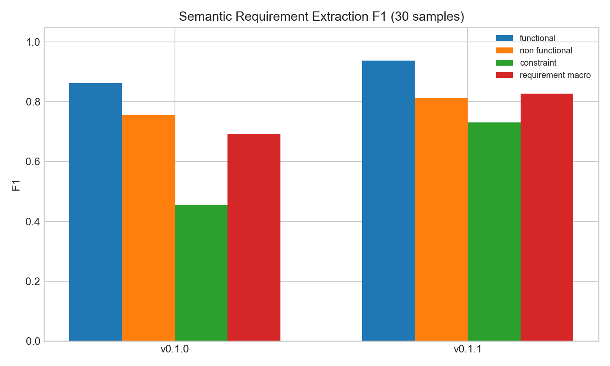
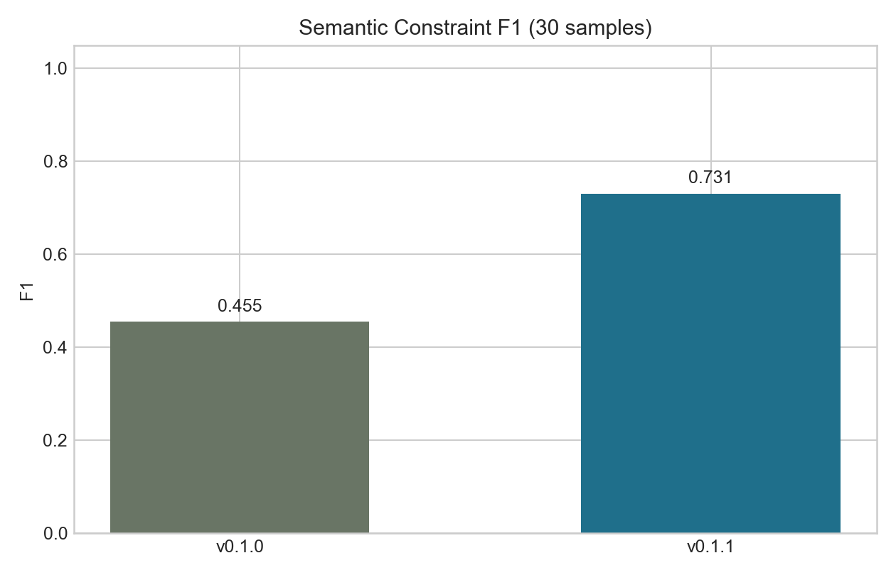
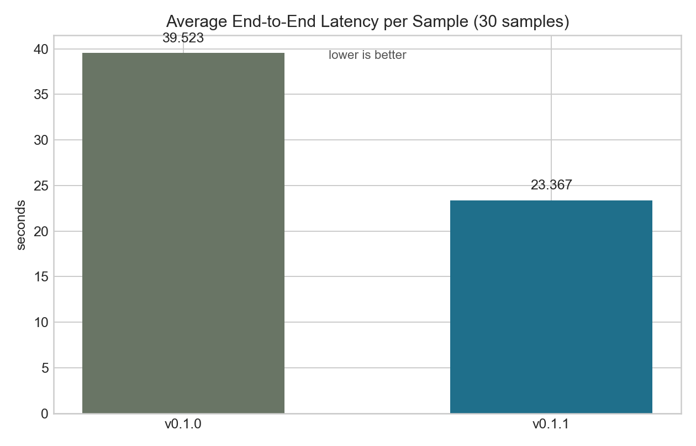
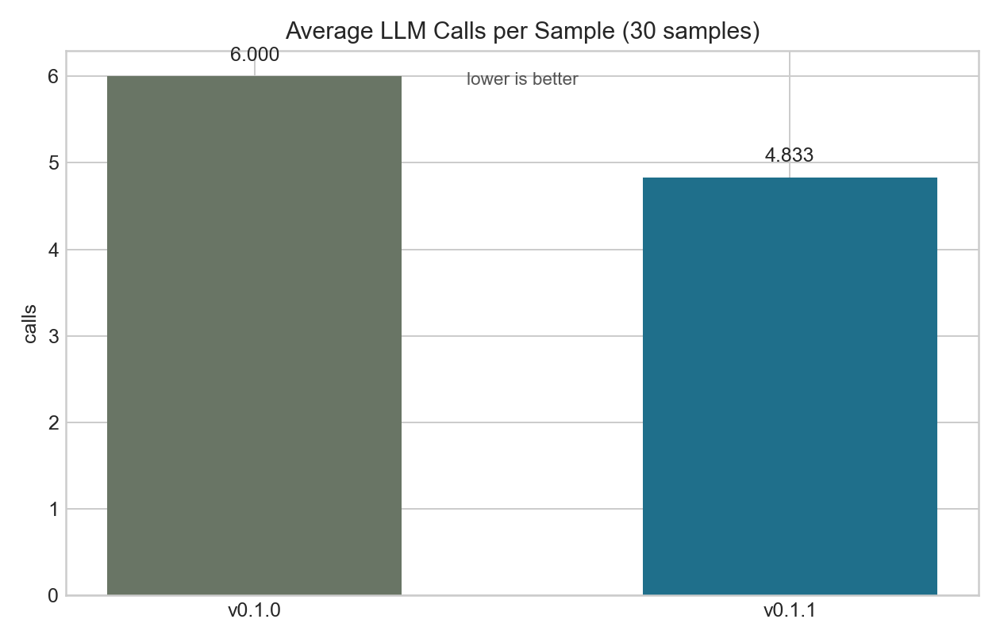
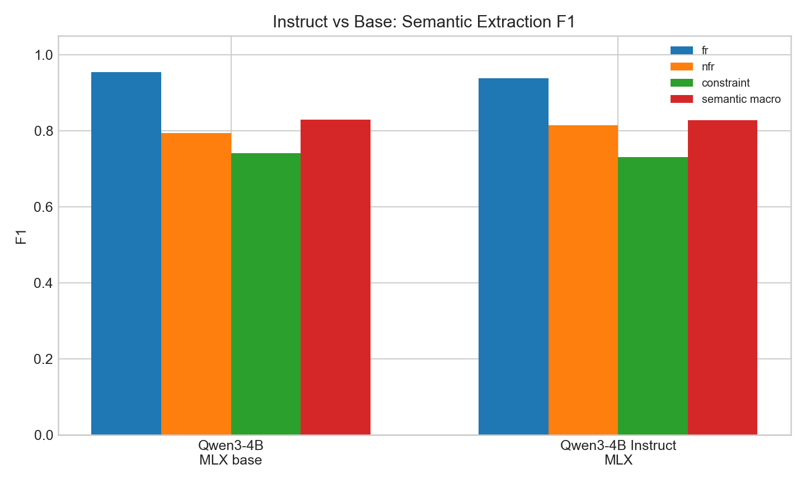
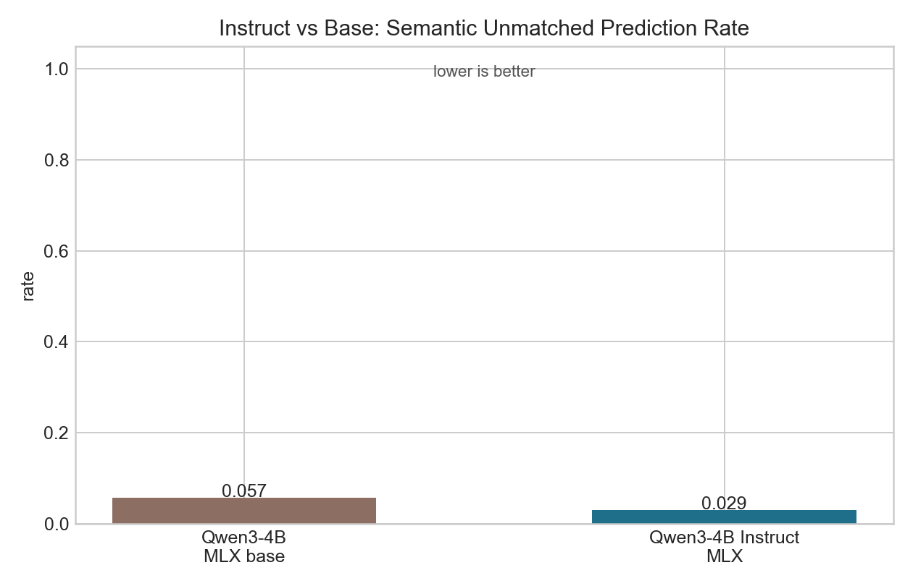

# Conversation-to-Spec v0.1.1: Source-Grounded Requirement Extraction and Verification

## Abstract

This project improves `conversation-to-spec`, a local pipeline that converts informal conversations into structured software requirements. The previous v0.1.0 pipeline could produce valid JSON, but it often struggled to separate functional requirements, non-functional requirements, constraints, and unresolved questions in unlabeled conversation text. It also lacked evidence spans, acceptance criteria, and requirement-level verification metadata. Based on related work in NLP for requirements engineering, LLM-based software specification generation, and grounded fact-checking, v0.1.1 redesigns the system around an instruction-tuned local model, source-unit based extraction, deterministic specification construction, confidence-aware post-processing, and MiniCheck-based claim-evidence verification. Both v0.1.0 and v0.1.1 were evaluated on the same 30-sample combined dataset using the same MLX model, `mlx-community/Qwen3-4B-Instruct-2507-4bit`, and the current v0.1.1 evaluator. Semantic requirement macro-F1 improved from 0.691 to 0.827. The largest category-level gain was in constraints, where semantic F1 improved from 0.455 to 0.731. Average end-to-end latency decreased from 39.52s to 23.37s, and average LLM calls decreased from 6.00 to 4.83 per sample. The main conclusion is that the improved pipeline increases recall and category coverage while keeping unmatched prediction rates low, although generated wording still requires human review.

## Introduction

Software requirements are often first discussed in informal conversations. These conversations contain decisions, questions, constraints, assumptions, and future-scope items mixed together. Converting such dialogue into a clear requirements specification is useful, but difficult: the system must identify what was actually agreed upon, avoid turning questions into requirements, distinguish functional requirements from non-functional requirements and constraints, and preserve traceability back to the source conversation.

The v0.1.0 version of this project attempted this task with a chain-style LLM pipeline. It generated usable structured output, but the output was not sufficiently traceable and did not include strong verification support. In particular, v0.1.0 did not produce acceptance criteria, evidence spans, or requirement-level groundedness metadata. It also showed weak constraint handling in the evaluation dataset.

The objective of v0.1.1 is to improve the practical quality of the generated requirements specification while keeping the system runnable on a local Apple Silicon machine. The specific goals are:

- improve extraction quality for functional requirements, non-functional requirements, and constraints;
- reduce the number of LLM calls and local execution time;
- add source-grounded evidence and acceptance criteria to generated requirements;
- verify generated requirements against the original conversation;
- keep the user-facing Markdown output readable while storing detailed diagnostic information in JSON.

The GitHub repository is available at: https://github.com/LeeMin-hyeong/conversation-to-spec

## Related Work

Necula, Dumitriu, and Greavu-Serban (2024) provide a systematic literature review of NLP in software requirements engineering from 1991 to 2023. The paper emphasizes that requirements engineering includes elicitation, specification, modeling, and validation, and that natural language requirements are prone to ambiguity, incompleteness, and inconsistency. The key implication for this project is that requirements extraction should not be treated as simple text summarization. It needs category-aware processing, ambiguity handling, and traceability. Therefore, v0.1.1 applies source-unit segmentation, requirement type separation, open-question handling, and semantic evaluation for each requirement category.

Xie et al. (2025) study how effective LLMs are at generating software specifications. Their work is directly relevant because it evaluates LLM-based specification generation rather than general text generation. The key lesson is that LLMs can help generate specifications, but their outputs still need task-specific structure, careful evaluation, and comparison against traditional or baseline methods. This motivated the project to keep the model fixed while comparing v0.1.0 and v0.1.1 pipeline designs. The improved results therefore support a pipeline-level claim rather than a vague claim that a stronger model alone improved performance.

Vogelsang (2024) discusses the use of generative LLMs for requirements engineering tasks. The paper argues that generative LLMs can be prompted directly for RE tasks, but that prompt quality and output format control are crucial. The applicable lesson is that local quantized models should not be asked to freely generate a complete nested specification without guardrails. In v0.1.1, the model is used as an instruction-following extractor, while deterministic code constructs the final specification. The model policy was also evaluated with both a base MLX model and an instruction-tuned MLX model. The instruction-tuned model did not win every F1 metric, but it produced lower unmatched prediction rates and slightly lower runtime cost, making it the more conservative default.

Tang, Laban, and Durrett (2024) introduce MiniCheck, a small fact-checking model for verifying whether LLM outputs are grounded in source documents. Their work is relevant because a generated requirement is useful only if it is supported by the original conversation. The applicable idea is to verify generated claims against evidence rather than trusting the generator output. v0.1.1 uses MiniCheck-based claim-evidence verification when `verify_mode=minicheck` is enabled and stores requirement-level confidence and verdicts in JSON reports. These metrics are not used as direct v0.1.0-vs-v0.1.1 extraction comparisons because v0.1.0 did not produce equivalent verification fields, but they improve the practical reviewability of the final specification.

Es et al. (2023) propose RAGAS for evaluating retrieval-augmented generation systems with dimensions such as context relevance, faithfulness, and answer quality. Although this project is not a full RAG system, the evaluation philosophy is useful: generation should be assessed with multiple diagnostic dimensions instead of a single score. This influenced the v0.1.1 evaluation design. The final comparison separates semantic extraction F1, unsupported prediction rate, latency, LLM calls, and schema validity. It also avoids using v0.1.1-only traceability fields as the main comparison graph, because that would overstate the improvement.

## Methods

### Data Preprocessing

The input is an unlabeled plain-text conversation. Speaker labels are optional. The system first segments the conversation into source units, such as `U1`, `U2`, and `U3`. Each generated requirement keeps references to these source units. This design allows the pipeline to check whether a requirement is grounded in the original conversation.

In v0.1.1, raw conversation text is not treated as a single block. The source-unit structure is used for requirement extraction, evidence span construction, open-question detection, and verification. The post-processing step also uses nearby source units to normalize privacy prohibitions, future-scope constraints, and ambiguous pronouns.

### Baseline Pipeline: v0.1.0

The v0.1.0 pipeline used a multi-stage chain. It performed candidate extraction, classification, rewriting, open-question generation, follow-up generation, and summarization through multiple LLM calls. This made the pipeline expensive and still weak at constraint extraction.

### Proposed Pipeline: v0.1.1

The v0.1.1 pipeline uses a source-unit decision prompt followed by deterministic construction and post-processing. The LLM produces source-grounded decisions, but the final specification is assembled by code. This design keeps the model focused on extraction and classification while code controls the final schema, evidence links, and user-facing Markdown structure.

### Verification and Post-processing

After deterministic construction, the pipeline enriches each requirement with evidence spans and acceptance criteria. Then, when `verify_mode=minicheck` is enabled, MiniCheck is used as the main verifier. Each generated requirement is treated as a claim, and the concatenated text of its referenced source units is treated as evidence. The MiniCheck-based verifier estimates whether the claim is supported by the evidence and stores the result as a requirement-level verdict and confidence value in JSON.

After verification, the pipeline applies confidence-aware cleanup for low-confidence or structurally weak items, including answered questions, privacy prohibitions, future-scope constraints, and ambiguous pronouns.

### Improvements over v0.1.0

Table 1 summarizes the main functional improvements from the v0.1.0 baseline to v0.1.1. These improvements are not all direct performance metrics. Some are output and reviewability features that make the generated specification easier to inspect.

| Area | v0.1.0 baseline | v0.1.1 improvement | Expected effect |
| --- | --- | --- | --- |
| Pipeline architecture | Multi-stage chain with repeated LLM calls | Source-unit decision plus deterministic construction | Fewer LLM calls and lower latency |
| Model policy | HF-oriented local model configuration | Apple Silicon MLX backend with instruction-tuned model preference | Better local execution and more stable instruction following |
| Requirement typing | Weaker handling of future or deferred items | Constraint normalization for deferred-scope statements | Better constraint detection |
| Traceability | Source unit references only | Source units plus evidence spans | Easier human review |
| Acceptance criteria | Not consistently generated | Given/When/Then-style criteria added during enrichment | More useful requirements draft |
| Groundedness verification | No requirement-level verifier output | MiniCheck-based support probability and verdicts stored in JSON | Reviewers can identify weakly grounded requirements |
| Diagnostic output | Markdown and debug output were less separated | User-facing Markdown plus detailed `spec.json`, `verification_report.json`, and `debug/spec/summary.json` | Cleaner specification with reproducible analysis data |
| Post-processing | Limited cleanup | Confidence-aware cleanup for weak items, answered questions, privacy prohibitions, and future constraints | Reduces common local-model artifacts |

### Experimental Setup

Both versions were evaluated with the same model:

```yaml
qwen3_4b_mlx_4bit:
  repo_id: mlx-community/Qwen3-4B-Instruct-2507-4bit
  backend: mlx
```

This model was selected for the main comparison because the project runs on Apple Silicon and the task benefits from instruction-following behavior. The model was held fixed so that the main result measures the pipeline change from v0.1.0 to v0.1.1 rather than a model upgrade.

The comparison used a combined 30-sample evaluation dataset created from `dataset/eval_samples.json`, `dataset/eval_booking.json`, `dataset/eval_services.json`, and `dataset/eval_ops.json`. To isolate pipeline differences, both v0.1.0 and v0.1.1 used the same model, `mlx-community/Qwen3-4B-Instruct-2507-4bit`. Because v0.1.0 did not originally include an MLX runner, a temporary compatibility runner was added only in a detached v0.1.0 worktree. The v0.1.0 generation pipeline itself remained unchanged.

The final comparable evaluation artifacts are stored under:

```text
experiments/version_compare/report_all_mlx_qwen3_4b_instruct_comparable/
```

An additional secondary model-policy experiment compares the v0.1.1 pipeline with a base MLX model and an instruction-tuned MLX model:

```text
experiments/version_compare/report_v011_instruct_vs_base_mlx/
```

The most important graph files used in this report are stored under `docs/assets/project#2/`:

- `semantic_extraction_f1.png`
- `constraint_f1.png`
- `avg_latency_sec.png`
- `avg_llm_calls.png`
- `instruct_vs_base_semantic_f1.png`
- `instruct_vs_base_semantic_unmatched.png`

### Evaluation Metrics

The main evaluation uses semantic F1 by requirement type. Functional requirements, non-functional requirements, and constraints are matched against gold items using lightweight semantic token overlap and source-unit overlap. Macro-F1 is the average of the three semantic F1 scores. Following the RAGAS-style evaluation philosophy, extraction quality, groundedness risk, runtime cost, and schema validity are reported as separate dimensions instead of being collapsed into one global score.

Unsupported prediction rates were measured separately. `semantic_unmatched_prediction_rate` counts a predicted requirement as unsupported only when it does not semantically match any gold requirement, regardless of type. This avoids the misleading interpretation of treating all paraphrases as hallucinations. Source-aware unmatched rate additionally requires source-unit overlap. Type mismatch is reported separately because a semantically valid requirement assigned to the wrong category is a classification error rather than a hallucination.

Because the semantic F1 metric is lightweight and project-specific, it should be interpreted as an internal comparison metric rather than a general benchmark score. MiniCheck verification metadata is used mainly for v0.1.1 reviewability and diagnostic analysis, not as the primary v0.1.0-vs-v0.1.1 extraction score.

## Results

### Main Comparison: v0.1.0 Baseline vs v0.1.1 Proposed Pipeline

Table 2 summarizes the comparable v0.1.0-vs-v0.1.1 evaluation results.

| Version | Pipeline | Semantic Macro F1 | FR F1 | NFR F1 | CON F1 | Semantic Unmatched | Source-aware Unmatched | Predictions | Latency | LLM Calls |
| --- | --- | ---: | ---: | ---: | ---: | ---: | ---: | ---: | ---: | ---: |
| v0.1.0 | chain | 0.691 | 0.862 | 0.755 | 0.455 | 0.047 | 0.075 | 106 | 39.52s | 6.00 |
| v0.1.1 | source-unit decision | 0.827 | 0.938 | 0.814 | 0.731 | 0.029 | 0.066 | 137 | 23.37s | 4.83 |

The strongest category-level improvement is in constraint detection. On the larger evaluation set, v0.1.0 reached constraint F1 of 0.455, while v0.1.1 reached 0.731. This is a more conservative and credible result than the earlier six-sample result. It shows that v0.1.1 is better at detecting future-scope and deferred-scope items as constraints, but it should not be interpreted as perfect constraint wording. Non-functional requirement F1 improved moderately from 0.755 to 0.814, and functional requirement F1 improved from 0.862 to 0.938.

The semantic macro-F1 improved from 0.691 to 0.827. This indicates that the improvement was not limited to one category, but the size of the improvement is now more realistic because it is measured across all available evaluation datasets.

### Runtime Efficiency

Runtime also improved. Average end-to-end latency decreased from 39.52 seconds to 23.37 seconds per sample. Average LLM calls decreased from 6.00 to 4.83 per sample. This supports the design decision to replace the multi-stage chain with a more compact source-unit decision plus deterministic post-processing pipeline. Although v0.1.1 still uses additional calls for enrichment, summarization, or verification-related steps, it reduces the repeated extraction, classification, and rewrite chain used in v0.1.0.

### Unsupported Prediction Analysis

The hallucination-related metrics are now more stable. The semantic unmatched prediction rate decreased from 0.047 to 0.029, and the source-aware unmatched rate decreased from 0.075 to 0.066. These changes are small, so the main claim should not be that hallucination was dramatically reduced. A safer interpretation is that v0.1.1 predicts more requirements overall while keeping unsupported-prediction rates at a similar or slightly lower level.

The following figures visualize the main changes in extraction quality and runtime efficiency.









### Secondary Ablation: Base vs Instruction-Tuned Model

Because the course includes fine-tuning and instruction tuning topics, an additional v0.1.1-only experiment compared the official base-style MLX model, `Qwen/Qwen3-4B-MLX-4bit`, with the instruction-tuned MLX model, `mlx-community/Qwen3-4B-Instruct-2507-4bit`. The pipeline and 30-sample dataset were fixed.

| Model | Semantic Macro F1 | FR F1 | NFR F1 | CON F1 | Semantic Unmatched | Source-aware Unmatched | Latency | LLM Calls |
| --- | ---: | ---: | ---: | ---: | ---: | ---: | ---: | ---: |
| Qwen3-4B MLX base | 0.829 | 0.954 | 0.794 | 0.741 | 0.057 | 0.086 | 24.30s | 4.93 |
| Qwen3-4B Instruct MLX | 0.827 | 0.938 | 0.814 | 0.731 | 0.029 | 0.066 | 23.37s | 4.83 |

This result does not show that the instruction-tuned model dominates every extraction F1 metric. The base model is slightly higher in semantic macro-F1 and functional F1. However, the instruction-tuned model has lower semantic unmatched prediction rate, lower source-aware unmatched rate, slightly lower latency, and slightly fewer LLM calls. Therefore, the instruction-tuned model is selected not because it wins every score, but because it gives a more conservative and operationally stable output profile for a requirements assistant.





## Discussion

The results show that v0.1.1 is a meaningful improvement over v0.1.0 for this project goal. The largest improvement is not simply that the model became better, because the same model was used in both versions. The improvement comes from pipeline design. The source-unit decision format, deterministic construction, and confidence-aware post-processing made the output more stable and better aligned with the evaluation categories.

The related work supports this direction. NLP4RE research emphasizes ambiguity, incompleteness, and the need for semantic processing in requirements engineering. This motivated source-unit segmentation and category-specific evaluation. LLM-based software specification research motivated controlled pipeline evaluation under a fixed model. Generative LLM work in requirements engineering emphasizes prompt design and output control, which motivated the controlled source-unit decision schema and the instruction-tuned model policy. MiniCheck directly motivated evidence-based verification: in v0.1.1, generated requirements are treated as claims and checked against source evidence before diagnostic verdicts are stored in JSON. RAGAS motivated separating evaluation dimensions rather than relying on one global score.

The comparison also shows an important trade-off. v0.1.1 predicts more requirements than v0.1.0, increasing the total predicted requirement count from 106 to 137. This improves recall and category coverage, especially for constraints, while the semantic unmatched and source-aware unmatched rates remain low. For a requirements engineering assistant, this trade-off is acceptable if the generated Markdown is treated as a draft for human review and if JSON verification metadata is available for inspection. However, it also means that the system should not be presented as a fully automatic replacement for human requirements analysis.

One limitation is that the evaluation dataset is still small compared with a real requirements engineering benchmark. Thirty samples are stronger than the initial six-sample comparison, but they are still course-project evidence rather than broad generalization proof. Another limitation is that the semantic matcher is lightweight and token-based. It is useful for controlled project evaluation, but future work should compare it with embedding-based or LLM-judge-based semantic matching. Finally, MiniCheck confidence helps identify weakly grounded requirements, but it is not a complete requirements validation method. For example, MiniCheck can check whether a requirement is supported by source evidence, but it cannot determine whether a requirement is complete, feasible, or aligned with stakeholder priorities.

## Conclusions

This project improved `conversation-to-spec` from v0.1.0 to v0.1.1 by changing the pipeline from a multi-stage chain to a source-unit decision pipeline with deterministic construction, instruction-tuned MLX inference, evidence enrichment, acceptance criteria generation, and MiniCheck-based verification. Under the same model and 30-sample dataset, semantic macro-F1 improved from 0.691 to 0.827. Constraint F1 improved from 0.455 to 0.731, and average LLM calls decreased from 6.00 to 4.83.

The main message is that pipeline structure matters as much as model choice. A local quantized model can produce better requirements specifications when the task is decomposed into source-grounded decisions, deterministic post-processing, and verification. Future work should expand the dataset, improve source-aware matching, add stronger coreference resolution, and evaluate the system with real stakeholder conversations.

## References

- Necula, S.-C., Dumitriu, F., and Greavu-Serban, V. (2024). A Systematic Literature Review on Using Natural Language Processing in Software Requirements Engineering. Electronics, 13(11), 2055. https://doi.org/10.3390/electronics13112055
- Xie, D., Yoo, B., Jiang, N., Kim, M., Tan, L., Zhang, X., and Lee, J. S. (2025). How Effective are Large Language Models in Generating Software Specifications? Proceedings of the 32nd IEEE International Conference on Software Analysis, Evolution and Reengineering (SANER), 1-12. https://doi.org/10.1109/SANER64311.2025.00014
- Vogelsang, A. (2024). Prompting the Future: Integrating Generative LLMs and Requirements Engineering. Joint Proceedings of REFSQ-2024 Workshops. https://ceur-ws.org/Vol-3672/NLP4RE-keynote1.pdf
- Tang, L., Laban, P., and Durrett, G. (2024). MiniCheck: Efficient Fact-Checking of LLMs on Grounding Documents. Proceedings of EMNLP 2024, 8818-8847. https://aclanthology.org/2024.emnlp-main.499/
- Es, S., James, J., Espinosa-Anke, L., and Schockaert, S. (2023). Ragas: Automated Evaluation of Retrieval Augmented Generation. arXiv:2309.15217. https://arxiv.org/abs/2309.15217
