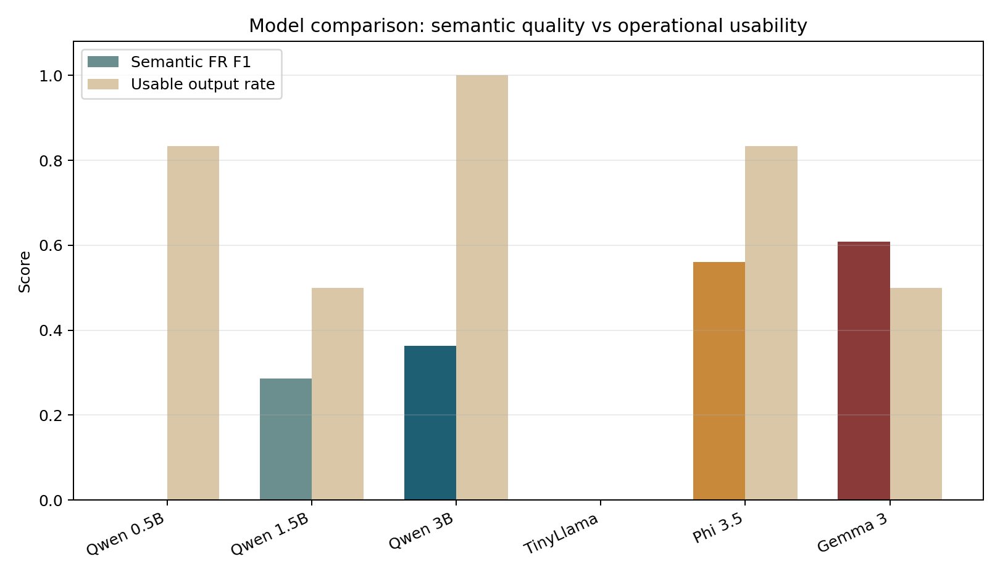
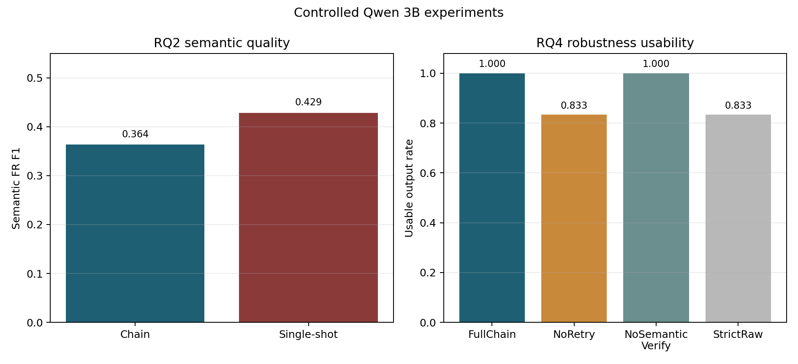

# Conversation-to-Spec Prototype Final Report

## Summary
This report presents Conversation-to-Spec, a local Python prototype that converts unlabeled English client-developer conversations into structured software specification drafts. The problem is that early project transcripts are informal, often omit speaker labels, and mix concrete requirements with vague ideas, constraints, and unresolved questions. The prototype addresses this with a multi-stage Hugging Face LLM pipeline that segments transcripts into traceable conversation units, extracts and classifies candidates, rewrites requirements, generates open questions and follow-up questions, and then applies JSON validation, repair, retry, fallback, semantic verification, and timestamped experiment logging. The final report combines a fresh April 24 rerun of the current chain pipeline with artifact-only semantic rescoring, plus controlled Qwen 3B chain-vs-single-shot and robustness-ablation experiments. Under semantic rescoring, Gemma 3 preserved the most functional-requirement meaning among the completed direct reruns (FR F1 0.6087), while Qwen 3B offered the best operational balance with 1.00 schema validity, 1.00 usable output, and FR F1 0.3636. In the controlled Qwen 3B comparison, both chain and single-shot stayed structurally valid, but single-shot captured more requirement meaning (semantic FR F1 0.4286 vs 0.3636) and ran faster. The Qwen 3B ablation also showed that retry improved usable output from 0.8333 to 1.0000, while semantic verification mainly added a review signal rather than changing schema success on this small set. Qualitative comparison explains the remaining tension: Gemma 3 often produced richer specification-like drafts, while Qwen 3B was more reliable as an operational model. The main conclusion is that semantic quality and operational stability must be evaluated separately.

## Introduction
Software requirements are often first discussed through informal client-developer conversations rather than clean written specifications. In classroom projects and early product planning, these transcripts may come from meetings or ASR output, may not include speaker labels, and frequently mix hard requirements with vague preferences, constraints, and unresolved issues. A plain summary is not enough in that setting because developers need a structured draft that separates functional requirements, non-functional requirements, constraints, open questions, and concrete follow-up questions.

This project addresses that problem with a Python prototype that converts unlabeled English conversation transcripts into structured specification drafts. The objective was to keep the workflow fully local, use only Hugging Face pretrained models, preserve traceability through source-unit IDs, and evaluate the system quantitatively rather than only through examples. The final report focuses on three evidence blocks: a fresh current-pipeline model comparison, a controlled Qwen 3B chain-versus-single-shot comparison, and a controlled Qwen 3B robustness ablation. Because exact text matching can understate semantic success, the final written analysis also includes an artifact-only semantic rescoring pass over the saved prediction JSON files.

## Execution Environment
All experiments were conducted on a local Windows desktop. This environment is important because the project uses local Hugging Face inference rather than external APIs, so GPU memory, system RAM, and runtime constraints directly affected model selection and latency.

| Component | Specification |
| --- | --- |
| Operating system | Windows 11 Home 64-bit, version 10.0.26200 |
| CPU | Intel Core i7-10700 @ 2.90 GHz |
| CPU cores | 8 physical cores / 16 logical processors |
| RAM | 32 GB class system memory |
| GPU | NVIDIA GeForce RTX 3070 |
| GPU memory | 8192 MiB VRAM |
| NVIDIA driver | 591.86 |
| CUDA version | 13.1 |
| Python environment | Python 3.12.10 virtual environment |

These hardware limits affected the final experiment design. Very slow or larger local models were excluded from repeated final runs, and latency was interpreted as an operational result rather than only as an implementation detail.

## Methods
### Repository and implementation scope
The implementation lives in a local Python repository: [GitHub repository](https://github.com/LeeMin-hyeong/NLP). The prototype is CLI-first rather than web-based and focuses on transcript-to-spec generation, validation, evaluation, and experiment logging [1].

The current implementation includes:
- segmentation of raw conversation text into `U1`, `U2`, `U3`, ... conversation units,
- a chained pipeline in [app/pipeline.py](../app/pipeline.py),
- JSON-only prompt construction in [app/prompt_builder.py](../app/prompt_builder.py),
- parsing, repair, validation, and semantic verification in [app/extractor.py](../app/extractor.py),
- local model abstraction in [app/model_runner.py](../app/model_runner.py),
- quantitative evaluation in [app/evaluation.py](../app/evaluation.py),
- timestamped experiment folders under `experiments/runs/<timestamp>/`.

The system outputs both `spec.json` and `spec.md`, stores per-sample debug artifacts, and records run metadata such as model alias, dataset path, prompt configuration, pipeline mode, and ablation profile.

### Data and preprocessing
The main evaluation set is `dataset/eval_samples.json`, which contains six manually prepared English client-developer transcripts spanning small software domains such as cafe websites, booking systems, library reservations, and tutoring platforms. Each sample has gold annotations for functional requirements, non-functional requirements, constraints, open questions, follow-up questions, and notes.

Preprocessing is intentionally lightweight. The input transcript is segmented into conversation units, each unit receives a deterministic ID, and later generations must cite these IDs in `source_units`. This design lets the pipeline work even when speaker labels are missing and supports PM-style traceability review.

### Models
The fresh current-pipeline model comparison in this report used six local Hugging Face models:
- `Qwen/Qwen2.5-0.5B-Instruct`,
- `Qwen/Qwen2.5-1.5B-Instruct`,
- `Qwen/Qwen2.5-3B-Instruct`,
- `TinyLlama/TinyLlama-1.1B-Chat-v1.0`,
- `microsoft/Phi-3.5-mini-instruct`,
- `google/gemma-3-1b-it`.

Reruns that were not environment-compatible or did not complete within the available runtime budget were not included in the final model-comparison table.

The controlled RQ2 and RQ4 experiments used `Qwen/Qwen2.5-3B-Instruct`, because the fresh current-pipeline rerun identified Qwen 3B as the strongest overall deployment candidate. Shared decoding settings were conservative: `max_new_tokens=900`, `temperature=0.0`, `top_p=1.0`, and `do_sample=False`.

### Pipeline
The chained pipeline performs the following steps:
1. segmentation,
2. candidate extraction,
3. candidate classification,
4. requirement rewriting,
5. open question generation,
6. follow-up question generation,
7. project summary generation,
8. deterministic final assembly into `SpecOutput`,
9. semantic verification and warning generation.

The final schema contains `project_summary`, `functional_requirements`, `non_functional_requirements`, `constraints`, `open_questions`, `follow_up_questions`, `notes`, `conversation_units`, and `verification_warnings`.

### Robustness layer
The prototype uses several layers of output hardening: JSON-only prompting, object extraction from noisy generations, lightweight repair, stage-specific validation, retry prompts, deterministic fallbacks for selected stages, semantic verification, and debug logging. The controlled RQ4 ablation compared four variants:
- `FullChain`,
- `NoRetry`,
- `NoSemanticVerify`,
- `StrictRaw`.

### Experiments and analysis
`Phi-3.5 Mini` did not finish the rerun end-to-end within the available time window, so its row was reconstructed from five completed prediction artifacts plus one timeout failure. This is explicitly marked in the results table.

Results were analyzed in two layers. First, the standard pipeline metrics kept exact-match precision/recall/F1, schema validity, usable output rate, hallucination rate, open-question recall, follow-up coverage, latency, and the added robustness diagnostics `retry_recovery_rate` and `fallback_rescue_rate`. Second, the final report applies artifact-only semantic rescoring to the saved prediction files. This relaxed scorer groups items by `source_units`, merges multiple prediction lines from the same evidence span, and treats two items as matched when lexical-semantic overlap passes category-specific thresholds. Requirement hallucination is also recomputed in a type-agnostic way so that a semantically grounded requirement is not penalized only because it was phrased differently or assigned the wrong requirement subtype.

Exact-match scoring remains the primary reproducible metric because it is deterministic and easy to audit. Semantic rescoring is used only as a secondary interpretive analysis over frozen prediction artifacts; no model output was regenerated, edited, or manually corrected during this pass. The rescoring was added because requirement drafts often preserve the same implementation intent with different wording, which makes exact string matching overly punitive for a specification-generation task.

The semantic rescoring used fixed category-specific thresholds after lowercasing, punctuation stripping, stop-word removal, and light normalization. Functional requirements required at least `0.40` lexical-semantic token overlap with the gold item, non-functional requirements required `0.35`, constraints required `0.35` plus a boundary or limitation cue when available, and open or follow-up questions required `0.30` because question wording is shorter and more variable. Matches were restricted to the same sample and prioritized items with the same or overlapping `source_units`; items without plausible evidence alignment were not counted as semantic matches. Semantic hallucination was recomputed as the share of predicted requirements that could not be aligned to any gold requirement or constraint in the same sample under these rules.

### Experimental reproducibility controls
The final evaluation set contains six manually annotated transcripts in `dataset/eval_samples.json`. They cover small but different software domains, including a cafe website, a dental clinic booking system, a library room reservation workflow, a student club scheduler, and a tutoring slot platform. All final comparisons used the same dataset, gold annotation categories, output schema, and metric definitions.

For the chain-versus-single-shot comparison, the fixed factors were the model (`Qwen/Qwen2.5-3B-Instruct`), dataset, decoding configuration, output schema, and evaluation script. The changed factor was only the pipeline mode: the chained run used stage-wise extraction/classification/rewriting/assembly, while the single-shot run asked the same model to produce the final schema directly. For the robustness ablation, the fixed factors were again the model, dataset, schema, and decoding settings; the changed factor was the availability of retry, semantic verification, and strict raw-output handling.

Failed or incomplete runs were handled conservatively. A sample was counted as unusable when the final `SpecOutput` could not be parsed and validated. A model was excluded from the final table if it was not environment-compatible or could not complete enough samples for a meaningful comparison. When a row was reconstructed from existing artifacts, the report marks it explicitly and treats missing samples as failures rather than silently dropping them.

## Results
### Current-pipeline model comparison
Table 1 summarizes the fresh April 24 rerun of the current chain pipeline on the base evaluation set. Exact metrics are retained for structural comparability, while the relaxed columns summarize semantic meaning preservation from saved prediction artifacts.

| Model | Schema | Usable | FR F1 Exact | FR F1 Semantic | Hall. Exact | Hall. Semantic | Avg Latency (s) | Notes |
| --- | ---: | ---: | ---: | ---: | ---: | ---: | ---: | ---: |
| Qwen 0.5B | 0.8333 | 0.8333 | 0.0000 | 0.0000 | 1.0000 | 0.4444 | 45.1693 |  |
| Qwen 1.5B | 0.5000 | 0.5000 | 0.0952 | 0.2857 | 0.8333 | 0.3333 | 82.0548 |  |
| Qwen 3B | 1.0000 | 1.0000 | 0.0909 | 0.3636 | 0.8571 | 0.4286 | 60.2314 |  |
| TinyLlama 1.1B | 0.0000 | 0.0000 | 0.0000 | 0.0000 | 0.0000 | 0.0000 | 0.0000 |  |
| Phi-3.5 Mini | 0.8333 | 0.8333 | 0.0000 | 0.5600 | 1.0000 | 0.2727 | 1238.5673 | Reconstructed from 5 completed prediction artifacts plus 1 timeout failure. |
| Gemma 3 1B | 0.5000 | 0.5000 | 0.0800 | 0.6087 | 0.9000 | 0.0000 | 523.5316 |  |

The rerun shows that exact-match scoring understated how much requirement meaning some models preserved. Under semantic rescoring, `Gemma 3` achieved the strongest functional-requirement fidelity among the completed direct reruns (`FR F1 = 0.6087`) and its relaxed hallucination dropped to `0.0000`, meaning every predicted requirement that survived comparison could be grounded to some gold requirement on the same evidence span. `Qwen 3B` remained the strongest operational balance because it combined `1.0000` schema validity, `1.0000` usable output, moderate latency, and a non-trivial semantic FR score of `0.3636`. `Qwen 1.5B` stayed in the middle with weaker usability but reasonable semantic gains. Reconstructed `Phi-3.5 Mini` also showed high semantic recovery (`0.5600`), but its extreme latency and partial-run status make it a weak deployment candidate. `TinyLlama 1.1B` remained unusable under the current chain prompts.

Figure 2 makes the main trade-off clearer than the table alone. Gemma 3 and Phi-3.5 Mini preserve more functional-requirement meaning when they produce analyzable artifacts, but Qwen 3B is the only compared model that reaches full usable output while still preserving non-trivial semantic requirement content. This supports the report's split interpretation between specification completeness and deployable reliability.

### Qualitative same-input comparison: Qwen 3B vs Gemma 3
Table 2 compares outputs generated from the same input samples. This explains why the aggregate metrics and human reading of the drafts point to slightly different conclusions.

| Sample | Aspect | Qwen 3B chain output | Gemma 3 chain output | Interpretation |
| --- | ---: | ---: | ---: | ---: |
| cafe_website | Functional and non-functional coverage | FR: view today's menu and opening hours. Reservation, admin updates, and mobile loading mostly appear as follow-up questions. | FRs: view menu/hours, reserve tables, update menu items/prices. NFR: load quickly on mobile devices. | Qwen 3B is structurally conservative; Gemma 3 reads more like a complete first-pass specification. |
| tutor_slot_platform | Scope and ambiguity handling | FR: book tutoring sessions. Reliability, emails, and UI simplicity are mostly pushed into open or follow-up questions. | Summary captures tutoring, emails, exam-period reliability, and simple UI, but questions are noisier and source mapping is less clean. | Gemma 3 captures more intended scope; Qwen 3B is easier to validate and less noisy. |

The qualitative comparison supports a split conclusion. `Qwen 3B` is the best operational model because it reliably produces valid JSON and usable outputs. However, `Gemma 3` often creates drafts that look more like a complete specification when it succeeds. In the cafe example, Gemma extracts table reservation, staff menu updates, and mobile loading as specification items, while Qwen keeps only the menu/hours requirement and pushes other concrete requirements into follow-up questions. This makes Gemma's output feel more complete, even though it is noisier and less reliable.

### Controlled RQ2: Qwen 3B chain vs single-shot
The controlled RQ2 comparison used the same base dataset and the same output schema while changing only the pipeline mode. Table 3 shows both the original exact metrics and the artifact-only semantic rescoring.

| Mode | Schema | Usable | FR F1 Exact | FR F1 Semantic | Hall. Exact | Hall. Semantic | Avg Latency (s) |
| --- | ---: | ---: | ---: | ---: | ---: | ---: | ---: |
| Chain | 1.0000 | 1.0000 | 0.0909 | 0.3636 | 0.8571 | 0.4286 | 60.5630 |
| Single-shot | 1.0000 | 1.0000 | 0.0690 | 0.4286 | 0.9545 | 0.4286 | 33.7393 |

The Qwen 3B rerun changes the RQ2 interpretation again. Here both `chain` and `single-shot` remained structurally valid (`schema = 1.0000`, `usable output = 1.0000`), so the comparison becomes mostly about semantic quality and speed. Under semantic matching, `single-shot` captured more requirement meaning (`FR F1 = 0.4286`) than `chain` (`0.3636`) and ran much faster (`33.7s` vs `60.6s`). Relaxed hallucination was the same for both variants (`0.4286`), but `single-shot` triggered semantic warnings on every sample while the chained variant triggered none. This suggests that with the current best model, the chain no longer wins on headline quality, but it still provides a cleaner review signal and more explicit stage-wise control.

### Controlled RQ4: Qwen 3B robustness ablation
Table 4 reports the four first-pass Qwen 3B ablation variants.

| Variant | FR F1 | Schema Validity | Usable Output | Retry Recovery | Fallback Rescue | Semantic Warning | Avg Latency (s) |
| --- | ---: | ---: | ---: | ---: | ---: | ---: | ---: |
| FullChain | 0.0909 | 1.0000 | 1.0000 | 0.1667 | 0.0000 | 0.0000 | 60.7214 |
| NoRetry | 0.0952 | 0.8333 | 0.8333 | 0.0000 | 0.0000 | 0.0000 | 52.9755 |
| NoSemanticVerify | 0.0909 | 1.0000 | 1.0000 | 0.1667 | 0.0000 | N/A | 60.5207 |
| StrictRaw | 0.0952 | 0.8333 | 0.8333 | 0.0000 | 0.0000 | N/A | 52.9075 |

The Qwen 3B ablation yields a narrower but still useful conclusion. `FullChain` reached `1.0000` schema validity and `1.0000` usable output. Removing retry reduced both to `0.8333`, and `StrictRaw` ended at the same level because the only clear failure on this small set was a stage-3 schema error that retry could recover. Disabling semantic verification did not change exact quality or usability, so on this dataset semantic verification behaved mainly as a review-time warning layer rather than a rescue mechanism. In other words, Qwen 3B did not need the full robustness stack to stay mostly operational, but retry still provided a measurable benefit.

## Discussion
The final evidence supports a more nuanced conclusion than the earlier exact-match-only reading. Local Hugging Face models can produce structured drafts from unlabeled conversations, and semantic rescoring shows that they preserve more requirement meaning than the exact metrics suggested. The main gap is therefore not simply "models cannot understand the task." It is that exact wording, type assignment, and stage-level stability remain hard.

The current model comparison shows two different winners depending on the question. If the question is semantic fidelity and specification completeness, `Gemma 3` is strongest among the completed direct reruns, and the same-input qualitative comparison confirms that it often extracts more concrete requirements into the final spec. If the question is deployable balance, `Qwen 3B` is the best choice because it combines perfect schema validity and usable output with moderate latency and still keeps a meaningful semantic FR score. This is why the report should not collapse quality into a single number: Qwen 3B is the stronger operational model, while Gemma 3 has stronger specification-quality potential.

The chain-based architecture also looks different under semantic rescoring. In the controlled Qwen 3B comparison, `single-shot` preserved more requirement meaning than `chain`, so the chain does not outperform the simpler baseline on semantic FR for this dataset. Its value lies elsewhere: stage-wise control, explicit intermediate artifacts, and a cleaner semantic-warning profile. That makes the chain more review-friendly, but not automatically more semantically complete.

The robustness layer matters, but the Qwen 3B ablation shows that its components do not contribute equally. Retry clearly helped by recovering one stage-3 failure and lifting usable output from `0.8333` to `1.0000`. By contrast, semantic verification did not change schema validity or usable output on this six-sample set, and the available ablations did not show measurable fallback rescue. This means the strongest engineering claim is narrower than before: retry is demonstrably useful, while the rest of the robustness stack still needs broader evaluation before stronger claims are justified.

The main implication is practical: a PM-facing prototype can already use this system to generate drafts, warnings, and follow-up questions, but the outputs still require careful human review. The evaluation setup still limits strong claims because the gold set is small, the semantic rescoring is heuristic rather than embedding-based, and one model row (`Phi-3.5 Mini`) is reconstructed from partial artifacts.

## Conclusion
This project implemented a local Python Conversation-to-Spec prototype that transforms unlabeled English transcripts into structured requirement drafts with traceability, debugging support, and experiment logging. The current system demonstrates that local LLM pipelines can generate usable structured outputs and that a chain architecture plus robustness layer can recover outputs that would otherwise fail.

Semantic rescoring changes the headline interpretation. `Gemma 3` preserved the most functional-requirement meaning among the completed direct reruns, but `Qwen 3B` remained the best overall deployment candidate because it combined a useful semantic signal with perfect schema validity, full usable output, and much lower latency. In the controlled Qwen 3B study, `single-shot` captured slightly more requirement meaning than `chain`, while `chain` produced fewer semantic warnings and preserved the stage-wise control needed for inspection. The strongest engineering conclusion is therefore more specific than before: retry materially improves operability, but semantic quality and operational stability still need to be evaluated separately.

Future work should expand the gold dataset, replace the current lexical-semantic rescoring with stronger semantic-similarity evaluation, improve Stage 2 and Stage 3 prompt/validator alignment, and repeat the final controlled experiments on additional models under the latest pipeline implementation. The prototype could also be extended toward speech-to-text input, live meeting capture, and near-real-time specification drafting. That extension would require streaming segmentation, incremental schema updates, conflict handling across turns, and UI support for human approval while the conversation is still in progress.

## References
1. Lee, M.-h. *Conversation-to-Spec Prototype Repository*. GitHub. https://github.com/LeeMin-hyeong/conversation-to-spec
2. Hugging Face. *Transformers Documentation*. https://huggingface.co/docs/transformers/index
3. Google. *Gemma 3 1B IT model card*. https://huggingface.co/google/gemma-3-1b-it
4. Qwen Team. *Qwen2.5-0.5B-Instruct model card*. https://huggingface.co/Qwen/Qwen2.5-0.5B-Instruct
5. Qwen Team. *Qwen2.5-1.5B-Instruct model card*. https://huggingface.co/Qwen/Qwen2.5-1.5B-Instruct
6. Qwen Team. *Qwen2.5-3B-Instruct model card*. https://huggingface.co/Qwen/Qwen2.5-3B-Instruct
7. Microsoft. *Phi-3.5-mini-instruct model card*. https://huggingface.co/microsoft/Phi-3.5-mini-instruct
8. TinyLlama Team. *TinyLlama-1.1B-Chat-v1.0 model card*. https://huggingface.co/TinyLlama/TinyLlama-1.1B-Chat-v1.0
9. Pydantic. *Pydantic Documentation*. https://docs.pydantic.dev/
