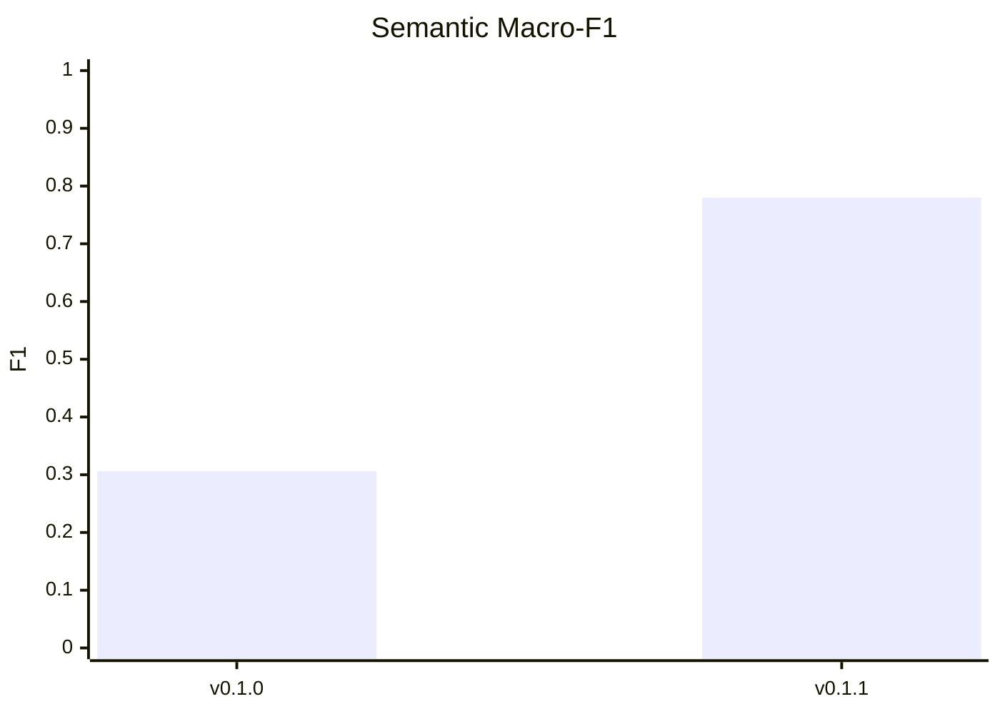
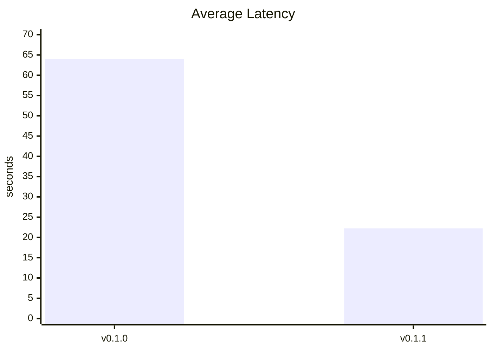
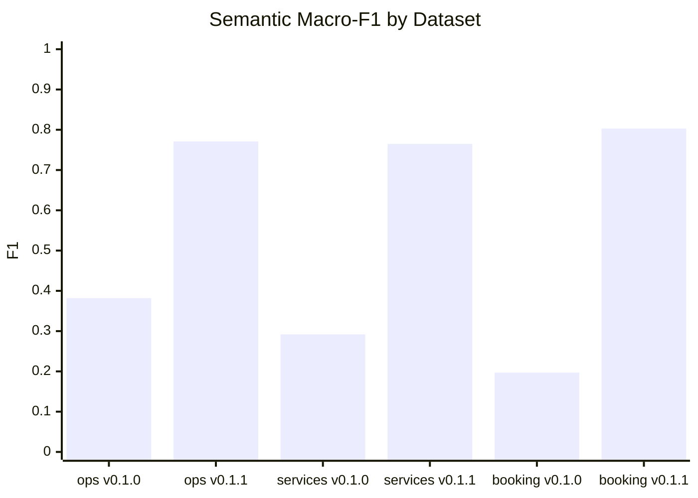
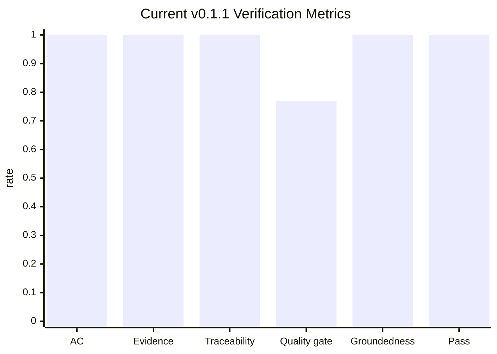
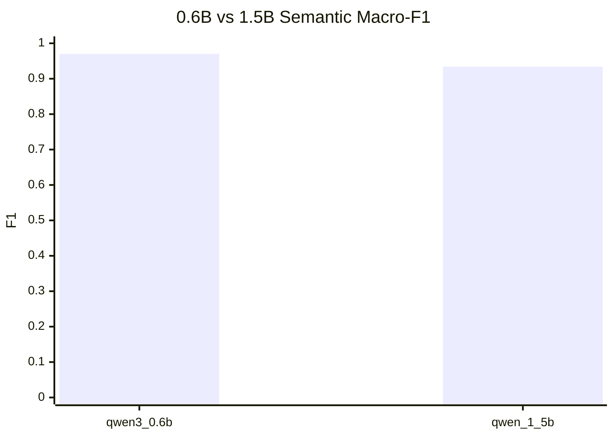

# Verifier-Guided Few-shot Conversation-to-Spec

## Summary

본 보고서는 비정형 client-developer 대화를 구조화된 소프트웨어 요구사항 초안으로 변환하는 `conversation-to-spec` 프로젝트의 `v0.1.1` 업그레이드를 설명한다. 기존 `v0.1.0`은 multi-stage chain prompting과 더 큰 기본 모델을 사용했지만, 생성 지연이 크고 산출물의 근거성, 테스트 가능성, unsupported detail을 충분히 검증하지 못했다. 본 프로젝트는 세 관련 연구에서 개선 방향을 도출했다. 소프트웨어 명세 생성 연구는 few-shot prompting과 failure analysis를, RAGAS는 reference-free groundedness/context relevance 평가를, MiniCheck는 claim-evidence verification 관점을 제공했다. 이를 바탕으로 `v0.1.1`은 작은 로컬 모델 기반 few-shot single-shot generation, source-unit traceability, deterministic quality checks, heuristic claim-evidence verification, selective repair를 결합했다.

실험은 mock이 아니라 로컬 Hugging Face 추론 산출물을 기준으로 작성했다. 기존 `v0.1.0`의 `pred.json`을 현재 evaluator로 재평가한 결과, 24개 generated sample에서 semantic requirement macro-F1은 0.306이었다. 현재 `v0.1.1`은 같은 24개 sample에서 semantic macro-F1 0.780, hallucination rate 0.172, 평균 latency 22.25초를 기록했다. 같은 비교에서 `v0.1.0`의 평균 latency는 63.97초였다. 결론적으로 `v0.1.1`의 핵심 개선은 단순한 모델 교체가 아니라, 빠른 생성과 source-grounded verification을 결합한 generate-then-verify 구조다.

## Introduction

소프트웨어 요구사항은 처음부터 정제된 명세서로 주어지지 않는다. 실제 프로젝트 초기에는 클라이언트와 개발자가 대화하면서 기능, 제약, 성능 기대, 향후 범위, 불확실한 결정사항을 한 문맥 안에서 섞어 말한다. 따라서 conversation-to-spec 시스템은 단순 요약보다 더 많은 일을 해야 한다. 기능 요구사항과 비기능 요구사항을 구분해야 하고, 각 요구사항이 어떤 대화 근거에서 나왔는지 추적 가능해야 하며, 최종 산출물이 테스트 가능한 형태인지도 확인해야 한다.

`conversation-to-spec`는 이러한 문제를 다루는 Python 기반 NLP course project이다. 입력은 plain text conversation이고, 출력은 `spec.json`, `spec.md`, `verification_report.json`, `verification_report.md`이다. 각 requirement 또는 constraint는 source units, evidence spans, acceptance criteria, quality checks, verification result를 포함한다.

기존 `v0.1.0`은 구조화된 요구사항 초안 생성 자체에 초점을 두었다. 그러나 실제 산출물 기준으로 다음 한계가 있었다.

- 큰 기본 모델과 chain prompting 때문에 latency가 컸다.
- source unit을 붙여도 실제 요구사항이 근거와 맞는지는 충분히 검증되지 않았다.
- acceptance criteria가 없어 테스트 가능한 명세로 쓰기 어려운 항목이 있었다.
- exact-match metric만으로는 paraphrase와 의미 보존 여부를 평가하기 어려웠다.
- LLM이 evidence에 없는 numeric threshold나 강한 요구사항 표현을 추가할 위험이 있었다.

`v0.1.1`의 목표는 다음과 같다.

1. 작은 로컬 모델과 single-shot prompt로 생성 지연을 줄인다.
2. few-shot prompt를 사용하되 example contamination을 줄인다.
3. conversation units를 evidence base로 사용해 requirement traceability를 강화한다.
4. acceptance criteria와 deterministic quality checks를 추가한다.
5. RAGAS/MiniCheck 관점을 참고한 verification metric을 추가한다.
6. 실패 항목만 선택적으로 repair하는 구조를 만든다.

GitHub repository:

```text
https://github.com/LeeMin-hyeong/conversation-to-spec
```

## Related Work

본 프로젝트는 세 논문을 그대로 재현하지 않는다. 각 논문에서 과제에 필요한 기술적 관점을 분석하고, 작은 로컬 모델과 대화 기반 요구사항 생성이라는 범위에 맞게 경량화하여 적용했다.

| Related work | 기술 분석 | 프로젝트 적용점 모색 | 실제 적용 |
| --- | --- | --- | --- |
| How Effective are Large Language Models in Generating Software Specifications? [1] | LLM은 소프트웨어 명세 생성에 활용될 수 있고, zero-shot/few-shot prompt strategy와 failure analysis가 품질에 큰 영향을 준다. | 요구사항 생성에서도 prompt 형식과 실패 유형 기록이 중요하다. | `v0.1.1`은 compact few-shot single-shot prompt를 사용하고, schema error, invalid source, hallucination, missing acceptance criteria, semantic warning을 기록한다. |
| RAGAS [2] | RAGAS는 reference-free evaluation으로 answer relevance, context relevance, faithfulness/groundedness를 평가한다. | conversation source units를 context로 보고, generated requirement를 answer/claim으로 평가할 수 있다. | source relevance, traceability coverage, groundedness rate, unsupported requirement rate, hallucination rate를 추가했다. Full RAGAS pipeline은 구현하지 않았다. |
| MiniCheck [3] | MiniCheck는 LLM output claim이 grounding document에 의해 지지되는지 확인하는 efficient fact-checking 접근이다. | 각 requirement를 claim으로 보고, source units와 evidence spans를 evidence로 사용할 수 있다. | heuristic claim-evidence verifier와 optional `MiniCheckScorer` backend를 구현했다. 본 보고서의 주요 평가 수치는 `--verify-mode heuristic` 실행 결과다. |

첫 번째 논문은 LLM 기반 명세 생성이 가능하더라도 prompt strategy와 failure diagnosis가 중요하다는 점을 보여준다. 본 프로젝트는 이 관점을 받아들여 긴 chain prompt를 줄이고, 작은 모델이 안정적으로 수행할 수 있는 source-unit decision generation으로 문제를 축소했다.

RAGAS는 RAG pipeline을 위한 평가 프레임워크이지만, 본 프로젝트에서는 별도의 retriever를 만들지 않았다. 대신 transcript를 `conversation_units`로 나누고, 각 requirement가 참조한 source units에 의해 충분히 지지되는지 확인한다. 즉 retrieved context 대신 segmented transcript를 context로 사용하는 lightweight adaptation이다.

MiniCheck는 claim-evidence verification 관점에서 직접적인 동기를 제공했다. 요구사항 문장을 claim으로 보고, source units와 evidence spans를 evidence로 사용한다. 코드에는 `lytang/MiniCheck-RoBERTa-Large`를 호출하는 optional backend가 있지만, 본 보고서에 사용한 주요 비교 실험은 재현성과 속도를 위해 heuristic verifier로 실행했다. 따라서 본 보고서에서는 “MiniCheck를 완전히 재현했다”가 아니라 “MiniCheck의 claim-evidence verification 관점을 적용했다”고 표현한다.

## Methods

### Overall Pipeline

현재 `v0.1.1` pipeline은 다음과 같다.

```text
Conversation
-> Source-unit preprocessing
-> Few-shot single-shot source-unit decision generation
-> JSON parsing and Pydantic validation
-> Deterministic spec construction
-> Quality checks
-> Claim-evidence verification
-> Failure diagnosis
-> Selective repair if enabled
-> Verified specification
```

중요한 설계 결정은 LLM이 최종 specification schema 전체를 만들지 않는다는 점이다. 작은 모델에게 requirement text, evidence spans, acceptance criteria, quality checks, verification을 한꺼번에 생성시키면 JSON truncation, reasoning 출력, few-shot example contamination이 쉽게 발생했다. 따라서 현재 prompt는 `source_unit_decisions` 중심으로 축소되었다.

LLM이 생성하는 항목은 다음이다.

```json
{
  "project_summary": "...",
  "source_unit_decisions": [
    {
      "source_unit": "U2",
      "decision": "functional_requirement",
      "claim": "short source-backed atomic decision"
    }
  ]
}
```

반대로 다음 항목은 코드와 verifier가 생성한다.

```text
final requirement text
evidence_spans
acceptance_criteria
quality_checks
verification
source_relevance_score
warnings
```

### Preprocessing

입력 대화는 줄 단위 source unit으로 분할된다.

```text
U1, U2, U3, ...
```

각 source unit은 이후 evidence base로 사용된다. 이 프로젝트는 full RAG 또는 Graph-RAG를 구현하지 않는다. 모든 traceability는 입력 transcript에서 만들어진 `conversation_units`에 기반한다.

### Prompt Style

Prompt는 few-shot single-shot 방식이다. 단, 작은 모델이 예시 내용을 복사하는 문제를 줄이기 위해 예시는 실제 업무 domain과 비슷한 풍부한 예시가 아니라 `EX_*` 형태의 추상 예시로 제한했다. Prompt에는 다음 원칙을 넣었다.

- example은 format only이다.
- example의 actor, object, domain term을 복사하지 않는다.
- output은 JSON object 하나만 반환한다.
- `<think>` 또는 reasoning을 출력하지 않는다.
- 각 `source_unit_decisions` item은 atomic decision row이다.
- evidence base는 제공된 `conversation_units`뿐이다.
- final requirements, acceptance criteria, quality checks, verification은 생성하지 않는다.

Qwen 계열 모델에서 reasoning text가 JSON 앞에 붙는 문제를 막기 위해 `/no_think`를 사용하고, parser 단계에서도 `<think>...</think>` block을 제거한다.

### Models

현재 기본 모델은 `configs/models.yaml`의 `qwen3_0.6b`이다.

| Alias | Hugging Face model | 역할 |
| --- | --- | --- |
| `qwen3_0.6b` | `Qwen/Qwen3-0.6B` | 현재 기본 생성 모델 |
| `qwen_1_5b` | `Qwen/Qwen2.5-1.5B-Instruct` | 비교 실험용 |
| `qwen2_5_3b_instruct` | `Qwen/Qwen2.5-3B-Instruct` | `v0.1.0` baseline 비교용 |

`v0.1.0`은 더 큰 3B 모델과 chain mode를 사용했다. `v0.1.1`은 0.6B 모델과 single-shot generation으로 latency를 줄이는 것을 목표로 했다.

### Verifier Design

Verifier는 각 requirement를 claim으로 보고 source units와 evidence spans를 evidence로 사용한다. 검증 항목은 다음과 같다.

- referenced source unit이 실제 conversation units에 존재하는가
- evidence spans가 비어 있지 않은가
- acceptance criteria가 비어 있지 않은가
- ambiguity risk가 `low`, `medium`, `high` 중 하나인가
- requirement와 evidence 사이의 source relevance가 충분한가
- evidence에 없는 numeric threshold가 새로 생기지 않았는가
- vague quality word가 측정 기준 없이 testable로 표시되지 않았는가
- future scope가 first-release requirement로 잘못 승격되지 않았는가

Verifier label은 다음을 사용한다.

```text
SUPPORTED
PARTIALLY_SUPPORTED
UNSUPPORTED
CONTRADICTED
NOT_ENOUGH_INFO
NOT_CHECKED
```

### Selective Repair

Selective repair는 전체 산출물을 fallback으로 덮어쓰는 방식이 아니다. Verifier가 약한 requirement를 찾았을 때만 해당 item을 고친다. 예를 들어 evidence에 없는 “within 2 seconds” 같은 numeric threshold가 acceptance criteria에 들어가면, verifier는 unsupported numeric detail로 표시하고 repair는 해당 수치를 제거하거나 open question으로 이동한다.

Repair 대상은 다음과 같다.

- weak acceptance criteria
- weak requirement wording
- unsupported numeric detail
- source-grounding이 약한 requirement
- first-release scope와 충돌하는 requirement

### Evaluation Metrics

기존 exact-match F1만으로는 자연어 생성 결과를 충분히 평가하기 어렵다. 따라서 `v0.1.1`은 다음 metric을 추가했다.

| Metric | 의미 |
| --- | --- |
| Exact FR/NFR/Constraint F1 | gold text와 exact match 기반 F1 |
| Semantic FR/NFR/Constraint F1 | deterministic token-overlap 기반 의미 유사 F1 |
| Semantic macro-F1 | FR/NFR/constraint semantic F1 평균 |
| Hallucination rate | gold와 의미적으로 맞지 않는 predicted requirement 비율 |
| Schema validity | JSON parse와 Pydantic validation 성공률 |
| Acceptance criteria coverage | acceptance criteria가 있는 requirement 비율 |
| Evidence span coverage | evidence span이 있는 requirement 비율 |
| Traceability coverage | valid source unit과 evidence가 있는 requirement 비율 |
| Source relevance average | requirement와 source evidence 사이 평균 관련도 |
| Groundedness rate | `SUPPORTED` 또는 `PARTIALLY_SUPPORTED` 비율 |
| Unsupported requirement rate | unsupported, contradicted, not-enough-info 비율 |
| Verification pass rate | `SUPPORTED` 비율 |
| Latency | 평균 실행 시간 |
| LLM calls | 평균 LLM 호출 수 |

## Results

### Evaluation Setup

`v0.1.0`과 현재 `v0.1.1`은 같은 24개 generated evaluation sample에서 비교했다. 기존 `v0.1.0`은 당시 산출된 `pred.json` 파일을 현재 semantic evaluator로 다시 읽어 semantic F1을 계산했다.

| Version | Pipeline | Model | Dataset | Verification |
| --- | --- | --- | --- | --- |
| `v0.1.0` | chain | `Qwen/Qwen2.5-3B-Instruct` | 3 generated datasets, 24 samples | original output rescored |
| current `v0.1.1` | single-shot + verifier | `Qwen/Qwen3-0.6B` | same 24 samples | `--verify-mode heuristic --repair-on-fail` |

사용한 current `v0.1.1` run artifacts는 다음이다.

```text
eval_output/20260611_033958/qwen3_0.6b__single_shot/
eval_output/20260611_034501/qwen3_0.6b__single_shot/
eval_output/20260611_034948/qwen3_0.6b__single_shot/
```

`v0.1.0` rescoring artifact는 다음이다.

```text
eval_output/20260611_v010_default_3b_rescored_current_semantic/rescored_metrics.json
```

### v0.1.0 vs Current v0.1.1

| Version | Samples | Usable Rate | Exact FR F1 | Exact Req. Macro-F1 | Semantic Macro-F1 | Hallucination Rate | Avg. Latency |
| --- | ---: | ---: | ---: | ---: | ---: | ---: | ---: |
| `v0.1.0` | 24 | 1.000 | 0.020 | 0.024 | 0.306 | 0.388 | 63.97s |
| current `v0.1.1` | 24 | 1.000 | 0.268 | 0.073 | 0.780 | 0.172 | 22.25s |





이 결과는 `v0.1.1`이 단순히 traceability field를 추가한 수준이 아니라, 같은 데이터셋에서 semantic F1과 latency를 동시에 개선했음을 보여준다. Exact macro-F1은 여전히 낮다. 이는 생성 문장이 gold 문장을 그대로 복사하지 않고 paraphrase되는 경우가 많기 때문이다. 따라서 자연어 requirement generation에서는 exact F1만으로 성능을 판단하면 개선을 과소평가할 수 있다.

### Dataset-Level Results

| Dataset | Version | Usable Rate | Exact FR F1 | Semantic Macro-F1 | Hallucination Rate | Avg. Latency |
| --- | --- | ---: | ---: | ---: | ---: | ---: |
| `generated_eval_ops` | `v0.1.0` | 1.000 | 0.000 | 0.382 | 0.417 | 75.88s |
| `generated_eval_ops` | `v0.1.1` | 1.000 | 0.043 | 0.771 | 0.200 | 22.93s |
| `generated_eval_services` | `v0.1.0` | 1.000 | 0.000 | 0.292 | 0.385 | 57.04s |
| `generated_eval_services` | `v0.1.1` | 1.000 | 0.320 | 0.765 | 0.171 | 20.54s |
| `generated_eval_booking` | `v0.1.0` | 1.000 | 0.063 | 0.197 | 0.333 | 58.99s |
| `generated_eval_booking` | `v0.1.1` | 1.000 | 0.440 | 0.803 | 0.146 | 23.28s |



### Verification Metrics

현재 `v0.1.1`의 24개 generated sample 결과는 다음과 같다.

| Metric | Current `v0.1.1` |
| --- | ---: |
| Acceptance criteria coverage | 1.000 |
| Evidence span coverage | 1.000 |
| Traceability coverage | 1.000 |
| Quality gate pass rate | 0.770 |
| Source relevance average | 0.903 |
| Groundedness rate | 1.000 |
| Unsupported requirement rate | 0.000 |
| Verification pass rate | 1.000 |
| Repair trigger rate | 0.566 |
| Repair success rate | 1.000 |
| Average LLM calls | 3.792 |



여기서 `Verification pass rate=1.000`은 reported run에서 heuristic verifier 기준으로 모든 requirement가 `SUPPORTED`였다는 뜻이다. 이는 실제 MiniCheck reproduction 결과가 아니며, heuristic verifier의 한계를 고려해 해석해야 한다.

### 0.6B vs 1.5B Comparison

6개 labeled evaluation sample에서 0.6B와 1.5B 모델을 비교했다.

| Model | Semantic Macro-F1 | Semantic FR F1 | Semantic NFR F1 | Semantic Constraint F1 | Hallucination Rate | Source Relevance | Avg. Latency | Avg. LLM Calls |
| --- | ---: | ---: | ---: | ---: | ---: | ---: | ---: | ---: |
| `qwen3_0.6b` | 0.970 | 1.000 | 1.000 | 0.909 | 0.034 | 0.928 | 21.3s | 2.83 |
| `qwen_1_5b` | 0.934 | 0.970 | 0.923 | 0.909 | 0.069 | 0.907 | 20.3s | 3.00 |



1.5B 모델이 항상 더 좋은 결과를 내지는 않았다. `library_room_reservation` 샘플에서 1.5B는 “Most users will access it from phones”를 기능 요구사항처럼 처리했다. 반면 0.6B는 이를 mobile access에 관한 non-functional requirement로 처리했다. 이 결과는 모델 크기 증가만으로 requirement classification 품질이 보장되지 않음을 보여준다.

### Production Probe

평가 데이터 외에 production-style 입력 세 개를 만들어 실제 산출물을 확인했다.

| Case | Model | Requirements | Warnings | Verification Pass | Groundedness | Unsupported Rate | Latency | LLM Calls |
| --- | --- | ---: | ---: | ---: | ---: | ---: | ---: | ---: |
| Clinic inventory | `qwen3_0.6b` | 8 | 4 | 1.000 | 1.000 | 0.000 | 30.2s | 1 |
| Clinic inventory | `qwen_1_5b` | 8 | 3 | 1.000 | 1.000 | 0.000 | 74.9s | 1 |
| Apartment maintenance | `qwen3_0.6b` | 7 | 5 | 1.000 | 1.000 | 0.000 | 28.6s | 1 |
| Apartment maintenance | `qwen_1_5b` | 7 | 5 | 1.000 | 1.000 | 0.000 | 32.5s | 1 |
| School trip forms | `qwen3_0.6b` | 7 | 5 | 1.000 | 1.000 | 0.000 | 34.5s | 1 |
| School trip forms | `qwen_1_5b` | 7 | 5 | 1.000 | 1.000 | 0.000 | 36.6s | 1 |

Production probe에서는 두 모델의 최종 요구사항 품질이 대체로 비슷했다. 1.5B는 clinic case에서 warning을 하나 줄였지만 latency가 크게 증가했다. 따라서 현재 기본 모델로는 0.6B가 더 실용적이다.

### Test Status

본 문서 갱신 과정에서 `uv run pytest`를 다시 실행하려 했지만, 로컬 Windows 환경의 `uv` cache 접근 권한 문제로 test collection 전에 실패했다.

```text
Failed to initialize cache at C:\Users\lmhst\AppData\Local\uv\cache
Access is denied. (os error 5)
```

따라서 이 보고서 초안에서는 새 pytest pass count를 주장하지 않는다. 제출 전에는 cache 권한을 수정한 뒤 `uv run pytest`를 다시 실행해야 한다.

## Discussion

결과에서 가장 중요한 점은 `v0.1.1`이 `v0.1.0`보다 빠르면서도 semantic requirement quality가 개선되었다는 것이다. 같은 24개 generated sample에서 semantic macro-F1은 0.306에서 0.780으로 증가했고, 평균 latency는 63.97초에서 22.25초로 감소했다. 이는 큰 모델과 chain prompting에 의존하기보다, 작은 모델의 역할을 source-unit decision generation으로 제한하고 deterministic verifier를 결합한 설계가 효과적이었음을 보여준다.

Few-shot prompting은 여전히 필요했다. 하지만 작은 모델에서는 few-shot example contamination이 발생하기 쉽다. 실제 실험 중 library reservation 입력에서 cafe booking 예시 문장이 출력되는 문제가 있었다. 이를 줄이기 위해 현재 prompt는 domain-rich example 대신 `EX_*` 형태의 추상 예시를 사용하고, 예시는 format only라고 명시한다.

Verification은 source unit이 이미 있어도 필요하다. 모델은 source unit을 붙이면서도 evidence에 없는 numeric threshold를 만들 수 있다. 예를 들어 원문에 “load quickly”만 있는데 acceptance criteria에 “within 2 seconds”가 추가되면, 이 문장은 테스트 가능해 보이지만 원문 근거가 없다. Verifier는 이런 unsupported detail을 warning 또는 partial support로 처리한다.

현재 verifier는 RAGAS와 MiniCheck의 관점을 적용했지만, full RAGAS나 실제 MiniCheck reproduction은 아니다. RAGAS의 context relevance와 groundedness 관점은 source relevance와 groundedness metric으로 경량화되었다. MiniCheck의 claim-evidence verification 관점은 heuristic verifier와 optional MiniCheck backend로 구현되었다. 본 보고서의 주요 수치는 heuristic verifier run에서 나온 값이므로, complex entailment나 contradiction에 대해서는 한계가 있다.

Latency trade-off도 남아 있다. `v0.1.1`은 baseline보다 빨라졌지만, `repair-on-fail`을 켜면 suspicious item에 대해 추가 LLM call이 발생한다. 따라서 모든 fallback을 LLM으로 바꾸는 것은 바람직하지 않다. 비용 대비 효과가 낮은 부분은 deterministic rule로 유지하고, 자연어 표현을 실제로 다시 써야 하는 부분에만 LLM을 사용하는 것이 더 현실적이다.

마지막으로 데이터 규모가 작다. 24개 generated evaluation sample, 6개 labeled sample, 3개 production probe만으로 일반화 성능을 강하게 주장할 수 없다. 또한 semantic F1은 human evaluation이 아니라 deterministic token-overlap 기반 metric이다. 이 점은 결과 해석에서 반드시 고려해야 한다.

## Conclusion

`conversation-to-spec v0.1.1`은 informal conversation에서 traceable and testable requirement draft를 생성하고 검증하는 verifier-guided few-shot pipeline이다. 기존 `v0.1.0`과 비교해 current `v0.1.1`은 같은 24개 generated sample에서 semantic macro-F1을 0.306에서 0.780으로 개선했고, 평균 latency를 63.97초에서 22.25초로 줄였다.

본 프로젝트의 핵심 메시지는 “더 큰 모델을 쓰면 해결된다”가 아니다. 실제 개선은 작은 모델 기반 빠른 generation, source-unit traceability, deterministic quality checks, claim-evidence verification, selective repair를 결합한 generate-then-verify 구조에서 나온다.

향후 작업은 다음과 같다.

- 더 큰 labeled evaluation set 구축
- human evaluation 추가
- 실제 MiniCheck backend를 사용한 대규모 검증 실험
- domain-specific requirement verifier
- constrained JSON decoding
- fine-tuning 또는 instruction tuning
- selective repair trigger의 precision 개선

## References

[1] Danning Xie, Byungwoo Yoo, Nan Jiang, Mijung Kim, Lin Tan, Xiangyu Zhang, and Judy S. Lee. "How Effective are Large Language Models in Generating Software Specifications?" arXiv:2306.03324, 2023. https://arxiv.org/abs/2306.03324

[2] Shahul Es, Jithin James, Luis Espinosa-Anke, and Steven Schockaert. "RAGAS: Automated Evaluation of Retrieval Augmented Generation." arXiv:2309.15217, 2023. https://arxiv.org/abs/2309.15217

[3] Liyan Tang, Philippe Laban, and Greg Durrett. "MiniCheck: Efficient Fact-Checking of LLMs on Grounding Documents." arXiv:2404.10774, 2024. https://arxiv.org/abs/2404.10774
